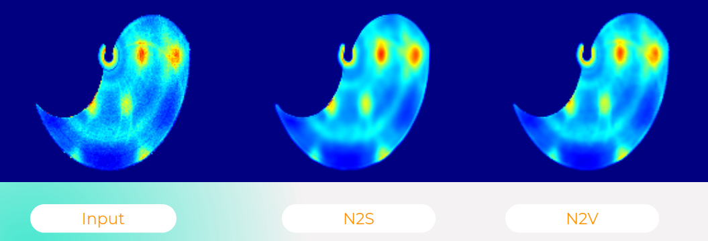

# Comparison of Deep Learning methods for 4D data denoising




This project aims to compare and evaluate various deep learning methods for denoising 4D neutron data (.sqw files). The methods that will be studied include Noise2Self, Noise2Void and Nl_means. The aim is to understand the advantages and limitations of each approach and to provide practical information for users who wish to apply these image denoising techniques in their own projects.
We propose to reproduce the results using simulated images that have been noised with different levels of Gaussian and poissonian noise. The noisy images will be stored in the `simulations` directory, and each sub-folder will correspond to a specific type of noise, containing the different realisations.

## Instructions on how to test the methods on images:

### 1. First, Clone this repository using the following command :
```shell
git clone https://github.com/Abdessamad-Badaoui/4D_Data_Denoising
```
### 2. Data Preparation :
To generate the noisy images, we provide a script called `generate.py`. This script generates 100 images of `simulations{N}.png` simulations which will be stored in the `simulations_clean_train` directory. Next, we will add noise using `noise.py`. You can run it by typing the following command:
```shell
python3 generate.py simulations/simulations_clean_train/
```
Then you type this command in the `simulations` directory:
```shell
python3 noise.py 
```
By running this command, noisy data with different types of noise will be created, and each set of data will be stored in the corresponding directory. For example, images noised with Gaussian noise will be stored in the `simulations/gaussian_images` directory, while images noised with poissonian noise will be stored in the `simulations/poisson_images` directory.
In addition, there is a `test_dataset` directory which contains the data we will use to evaluate our methods after training.

### 3. Testing the methods :
You can then use the `<method_name>` method to denoise the noisy images generated:
```shell
cd <methode_name>
```
where `<method_name>` is one of the 4 method names: `NL_Means`,`Wavelet-based Denoising`, `Noise2Self`, `Noise2Void`.

#### Non Local Menas (NL_Means) :
To begin with, we explore a denoising method that is not part of the Deep Learning (untrained) methods: the Non-local Means (NL Means) method. This approach is based on the principle of the similarity of pixels in an image and uses spatial information to reduce noise. Unlike Deep Learning methods, NL Means does not require prior training on a dataset. It is therefore often considered a 'training-free' denoising method.
Suppose you want to denoise the image `simulation_gaussian0.png`, you can use the following command (in the `NL_Means` directory):
```shell
python3 denoise.py ../simulations/test_dataset/gaussian_images/simulation_gaussian0.png ../simulations/test_dataset/simulations_clean_test/simulation0.png
```
This command takes the image to be denoised as its first argument, followed by the original noise-free image (used to calculate the PSNR).
The results obtained in terms of PSNR for this method are presented in the following table, the methods will be tested on the images contained in the directory `test_dataset`, we will focus in this presentation on the Poisson noise, because it is the type of noise closest to the noise that will be present in our real data:

|  | PSNR |
| ----------- | --------- |
| Simulation 0 |  37.40 |
| Simulation 1 | 37.38 |
| Simulation 2 |   37.42
| Simulation 3 |   38.59
| Simulation 4 |   36.84

It is important to note that PSNR has limitations in certain situations, particularly when evaluating specific properties related to neutron physics in images. While the PSNR measures the overall quality of the image in terms of perceptible noise, it may fail to detect subtle variations or important details related to specific physical phenomena. Therefore, it is essential to complete the evaluation by also performing a visual assessment to fully examine the performance of the method. The visual evaluation will allow us to take into account criteria such as sharpness, fidelity of detail, and preservation of the characteristics of the denoised image.

#### Wavelet-based Denoising :
The main idea behind wavelet-based denoising is to use the properties of wavelets to effectively remove noise from a signal while preserving the important features or structures of the signal.
Wavelet-based denoising operates in the wavelet domain, which is a representation of the signal at different scales or resolutions. The basic principle is that noise tends to be spread out across all scales, whereas the important features or structures of the signal are often concentrated in a few scales.
Suppose you want to denoise the image `simulation_gaussian0.png`, you can use the following command (in the `Wavelet` directory):
```shell
python3 denoise.py ../simulations/test_dataset/gaussian_images/simulation_gaussian0.png ../simulations/test_dataset/simulations_clean_test/simulation0.png
```
This command takes the image to be denoised as its first argument, followed by the original noise-free image (used to calculate the PSNR).
The results obtained in terms of PSNR for this method are presented in the following table :

|  | PSNR |
| ----------- | --------- |
| Simulation 0 |  40.38 |
| Simulation 1 | 39.97 |
| Simulation 2 |   40.63
| Simulation 3 |   40.79
| Simulation 4 |   38.73


#### Noise2Self :

The principle behind this method is that a deep neural network can be trained to denoise a single noisy image. This is possible because a 512*512 image contains enough information (~250,000 information dimensions) to allow the network to denoise the image. In this way, the model is trained using only the specific image that we want to denoise, but we can also try to train the model using all the data, given that all the images are sampled from the same distribution.
We propose an already trained neural network that we have stored in the files: `best_weights_100simulations.pkl` for the Poisson noise. You can now use this neural network to denoise an image of your choice. 
In the `Noise2Self` directory:
```shell
python3 predict.py ../simulations/test_dataset/poisson_images/simulation_poisson0.png ../simulations/test_dataset/simulations_clean_test/simulation0.png best_weights_poisson.pkl
```
This command takes the image to be denoised as its first argument, followed by the original noise-free image (used to calculate the PSNR), and finally the model to be used. When this command is run, a denoised image will be generated and stored in the `denoised_images` directory. In addition, the command will return the corresponding PSNR value, which measures the quality of the denoised image compared with the original image.
The results obtained in terms of PSNR for this method are shown in the following table:

|  | PSNR |
| -----------  | --------- |
| Simulation 0  | 30.05 |
| Simulation 1  | 34.03 |
Simulation 2  | 45.36
Simulation 3  | 35.23
Simulation 4  | 36.79

#### Noise2Void :
The principle of the Noise2Void method is based on the assumption that the noise is independent of the signal, while the image is smooth. In this context, by working with a receptive field that excludes the pixel in question, it is possible to predict the colour of this pixel based on its neighbourhood, but it is not possible to predict the noise because it is independent of the signal. So the Noise2Void method aims to learn how to remove noise by focusing solely on the information in the image itself, using deep learning techniques to reconstruct missing or noisy areas without recourse to a noise-free reference image. The neural network was trained on all realisations of each type of noise. As a result, we have a model trained on images with Poisson noise `n2v_poisson_model`.
You can then use this neural network to denoise an image of your choice. 
In the directory `Noise2Void` :
```shell
python3 predict.py ../simulations/test_dataset/poisson_images/simulation_poisson0.png ../simulations/test_dataset/simulations_clean_test/simulation0.png n2v_2D_poisson
```
This command takes the image to be denoised as its first argument, followed by the original noise-free image (used to calculate the PSNR), and finally the model to be used. When this command is run, a denoised image will be generated and stored in the `denoised_images` directory. In addition, the command will return the corresponding PSNR value, which measures the quality of the denoised image compared with the original image.


The results obtained in terms of PSNR for this method are presented in the following table:
|  | PSNR |
| -----------  | --------- |
| Simulation 0 | 40.57 |
| Simulation 1  | 48.35 |
Simulation 2  | 47.47
Simulation 3  | 41.09
Simulation 4  | 46.99


## Workflow for denoising .sqw files (4D neutron Data):

We are going to give some guidelines on how to carry out the different stages of the workflow on a given data set.

### 1. Cutting the .sqw file   :

First of all, the cuts need to be made in order to have 2D images that we know how to denoise, an example of the script is given in the `cuts_200.m` file. This script cannot be used for any dataset, it all depends on the number of step cuts you want to give to each dimension. You also need to modify the `data_path` with the path of your dataset.
For this demonstration, simply modify the path and run the script on matlab. Don't forget to run `horace_on()` at the matlab prompt to define all access to the Horace lib.
The cuts, which are .h5 files, will be saved in the `h5_files` directory.

### 2. Converting .h5 files to .png images :


To convert the cuts into images, simply run the following command:
```shell
python3 h5topng.py h5_files/ png_images/
```
The images will be saved in the `h5_files` directory.


### 3. Training :

The first step is to select images that we are going to use for training, as there are often many cropped images that contain no relevant information. This can be achieved using the script `image_selection.py`. The code in the script can be modified to adjust the thresholds used for this selection process.


```shell
python3 image_selection.py png_images/ Noise2Void/images/
```


Then we can start training. There are a few parameters in the `Noise2Void/train.py` file that we can adjust to find the best results.

Firstly, given the number of patches that will be generated, we need to divide this data into training data and validation data:

```code
# If we want to put N data for training :
X = patches[:N]
X_val = patches[N:]
```
In general, you always need more than 90% of the data for training, and the rest for validation (if we have sufficient data).

The `train_steps_per_epoch` parameter is equal to `number of training patches`/`batch size`, but it can be exceeded in our case to see the data more than once in the same epoch. Increasing this parameter increases the training time, but there is an improvement in the predections. However, you should also exercise caution regarding overfitting.

We also have other hyperparameters like `train_epochs`, `train_batch_size` and so on that we can adjust to get better results.


To do the training, we run the following command:

```shell
python3 train.py images/
```

Once training has been completed, the model will be stored in the `models` directory with the name specified in the `model_name` variable in the `train.py` file.


### 4. Denoising:

We can now denoise all the images by typing the following command: 

```shell
python3 denoise_all.py ../png_images/ n2v_data_200*200
```

This command takes as parameters the path to the images to be denoised, and the name of the model to be used for denoising.

The denoised images will be saved in the `denoised_images` directory.


### 5. Converting .png images to .h5 files :
First, we change the colormap of the images from grey to jet using the following command:

```shell
python3 gray2jet.py Noise2Void/images/ resultats/noisy_images/
python3 gray2jet.py Noise2Void/denoised_images/ resultats/denoised_images/
```
We then convert these images into .h5 files by typing the following command:

```shell
python3 png2h5.py resultats/noisy_images/ resultats/noisy_h5/
python3 png2h5.py resultats/denoised_images/ resultats/denoised_h5/
```
The .h5 files will be saved in the directories `noisy_h5` and `denoised_h5`.

### 6. Merging .h5 files :

To do this, we'll use the `merge_h5_files.py` script.
There are several parameters for this script, since the merge process depends on the way the cuts have been made, for our example :

```code
argv[1] = input_directory
argv[2] = output_h5_file
argv[3] = Number of cuts with respect to first dimension
argv[4] = Number of cuts with respect to second dimension
argv[5] = cutting step along the first dimension
argv[6] = cutting step along the second dimension
argv[7] = Min with respect to the first dimension
argv[8] = Min with respect to the second dimension
argv[9] = the third dimension
argv[10] = the fourth dimension
```

In the case of the `bnfs_10K.sqw` dataset, and the way we made the cuts in the `cuts_200.m` file, we have the following command:

```shell
python3 merge_h5_files.py resultats/noisy_h5/ resultats/noisy_merged.h5 21 67 0.24 0.05 -0.9825 -3.0342 175 366
```
This command generates the `noisy_merged.h5` file in the `results` directory, which can then be viewed by the Inviwo tool. We can do the same thing similarly for the other .h5 denoised files.
